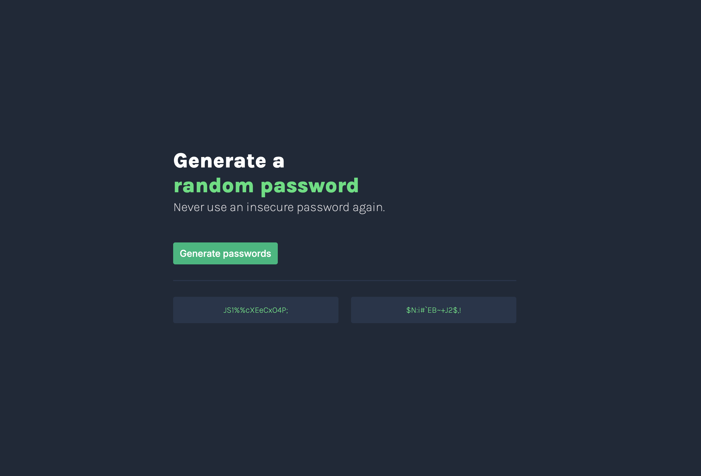

# Scrimba Password Generator 🔑

A simple and customizable password generator built with**JavaScript**, **HTML**, and **CSS**.  
This project was created as part of the Scrimba Frontend Developer Path to practice DOM manipulation, event handling, and responsive design.

---

## 🚀 Live Demo
[View Live Site](#) <!-- Replace # with your Netlify or GitHub Pages link -->

---

## 📸 Screenshot
 <!-- Update with actual screenshot file -->

---

## 🛠️ Getting Started

To run this project locally:

```bash
# Clone the repository
git clone https://github.com/yourusername/Scrimba_Password_Generator.git

# Navigate into the project folder
cd Scrimba-Password-Generator

# Install dependencies
npm install

# Start development server
npm run dev
```

The app will be running at [http://localhost:5173](http://localhost:5173).

---

## ✨ Features
- Generate strong random passwords instantly
- Option to include/exclude:
  - Uppercase letters
  - Numbers
  - Symbols
- Copy-to-clipboard functionality
- Responsive design for desktop and mobile

---

## 🧑‍💻 Built With
- HTML5
- CSS3 (Flexbox & Grid)
- Vanilla JavaScript (ES6+)

---

## 📚 What I Learned
- Using `Math.random()` with character sets to generate unique passwords
- Event listeners for interactive UI
- Managing state and user preferences
- Practicing clean, semantic HTML and modular CSS

---

## 🤔 Future Improvements
- Dark/Light theme toggle
- Password strength indicator
- Save password history
- Deploy final version to Netlify

---

## 🙌 Acknowledgements
This project is part of the [Scrimba Frontend Career Path](https://scrimba.com/learn/frontend).  
Special thanks to the Scrimba community for their support and resources. 💜

---

## 📄 License
This project is licensed under the MIT License.